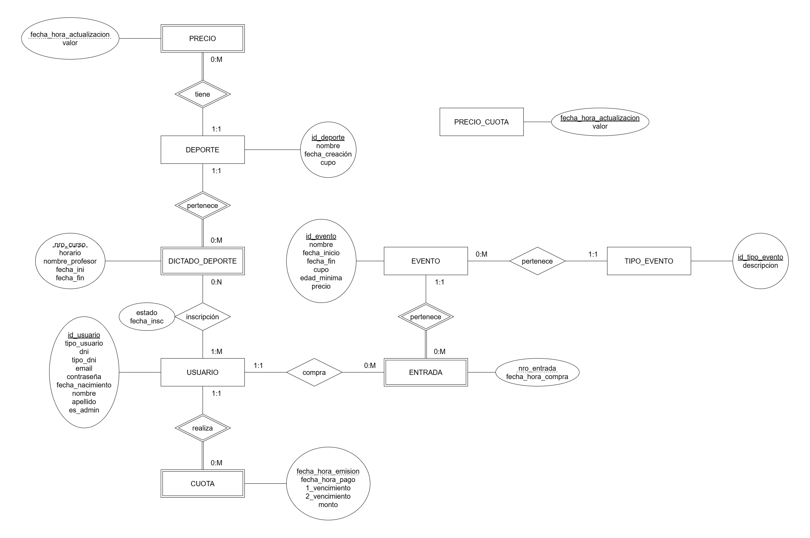

# Propuesta TP DSW

## Grupo

### Integrantes

- 52618 - Cosimo, Ivo.
- 53246 - Ulla, Lucas.

### Repositorio

- [frontend app](https://github.com/LucasUlla/Frontend-TP-DSW)
- [backend app](https://github.com/LucasUlla/Backend-TP-DSW)

## Tema

### Descripción 

Gestión de socios, deportes y eventos de un club deportivo. Los socios podrán manejar sus datos personales, inscripciones a deportes, pagos de cuotas y compra de entradas para eventos deportivos. 

### Modelo

## Alcance Funcional

### Alcance Mínimo

Regularidad:
|Req|Detalle|
|:-|:-|
|CRUD simple|1. CRUD Deporte 2. CRUD Usuario|
|CRUD dependiente|1. CRUD Dictado_Deporte {depende de} CRUD Deporte|
|Listado + detalle| 1. Listado de dictado de deportes filtrado por deporte y/o precio. Muestra el nombre, cupo, precio => detalle Dictado_Deporte |
|CUU/Epic|1. Inscripción a deporte|

 

Adicionales para Aprobación:
|Req|Detalle|
|:-|:-|
|CRUD |1. CRUD Deporte 2. CRUD Dictado_Deporte 3. CRUD Pago 4. CRUD Precio 5. CRUD Usuario  6. CRUD Precio_Cuota|
|CUU/Epic|1. Inscripción a deporte 2. Pago de cuota de socio|

### Alcance Adicional Voluntario

*Nota*: El Alcance Adicional Voluntario es opcional, pero ayuda a que la funcionalidad del sistema esté completa y será considerado en la nota en función de su complejidad y esfuerzo.

|Req|Detalle|
|:-|:-|
|Listados |1. Listado de eventos disponibles => detalle Evento  2. Listado de entradas compradas => detalle Entrada|
|CUU/Epic|1. Adquisión de entradas|
|Otros|1. |

